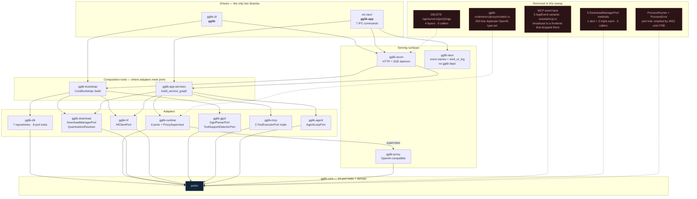

# Phase 1 — The Dead Code Sweep

**Shipped in v0.14.0.** Eleven pull requests (#843 → #853), merged 14–15 August 2026.

This was a systematic audit of everything the compiler could not see. The premise was
narrow: a Rust workspace hides dead code behind *visibility*, because `dead_code` must
assume any externally reachable item has a caller in some other crate. Close the module
trees, and the compiler starts talking.

It found more than dead code. Two production bugs surfaced along the way — neither of
them looked like a bug, which is why they had survived. A CI guard turned out to be
incapable of failing. And the sweep's own stated justification turned out to be false,
caught by the review panel and corrected in the manifest where it had been written down.

---

## At a glance

| Measure | Value |
|---|---|
| Pull requests | **11** (#843–#853) |
| Atomic commits | **56** |
| Files touched | **388** |
| Lines added / removed | **+4,124 / −3,663** |
| Net, whole arc | **+461** |
| Net, excluding the #850 bug-fix arc | **−1,128** |
| Files deleted outright | **4** |
| Individual dead items removed | **121** |
| Items narrowed to `#[cfg(test)]` rather than deleted | **12** |
| Production bugs found and fixed | **2** |
| Regressions caught in review, before merge | **1** |
| CI guards that could not fail, repaired | **1** |

Test suite at the close: **2,974 Rust tests** (identical under `--all-features` and
CI's default-feature configuration), **29 doctests**, **817 TypeScript tests**, clippy
`--workspace --all-targets --all-features -D warnings` at **zero diagnostics**.

### On the two net figures

Both are reported because either one alone is misleading.

The arc is **net positive** for two reasons that have nothing to do with cleanliness.
#850 shipped a real database migration and its regression suite (+1,742/−153). And
narrowing visibility *adds* lines: `pub(crate)` is seven characters longer than `pub`,
which pushes signatures past 100 columns, and rustfmt reflows them across three lines.
The four visibility PRs are **+70** between them despite deleting code.

Strip out #850 and the sweep is **−1,128**. The three deletion-focused PRs (#847, #848,
#851) are **−1,402** between them. Five of the eleven are net-negative overall.

---

## The architecture, after



**Read the edges as composition, not as the dependency graph.** Many direct
dependencies are omitted to keep the shape legible: every driver and both composition
roots depend on `gglib-core` directly, as does `gglib-axum`, and `gglib-cli`
additionally depends on `gglib-proxy` and on five adapters the diagram routes through
the composition roots instead. `gglib-proxy`'s own core edge *is* drawn, and
`gglib-tauri` has none to draw. `gglib-core` has **14 dependents** in total — 13 as a
normal dependency, plus `gglib-integration-tests` as a dev-dependency. `gglib-sse`,
`gglib-build-info` and `gglib-integration-tests` are not drawn at all.

What the diagram *is* meant to show: every arrow into `gglib-core` now lands on a port
trait with at least one production implementor, and no port declares a method with no
**production** caller. `DownloadManagerPort` went from **16 methods to 11**. `AppEvent`
went from **19 variants to 14**. The OpenAI request/response type set went from **two
copies to one**.

The single edge that breaks the visual layering — `gglib-cli → gglib-axum`, so
`gglib daemon run` can host the daemon in-process — is deliberate and documented.
`scripts/check_boundaries.sh` forbids surface-to-surface dependencies with exactly that
one exception. Note that the script's own `SURFACE_CRATES` is a different set from this
diagram's "Serving surfaces" box: it means `{gglib-cli, gglib-axum, gglib-tauri}`.

Two clarifications, because both are easy to get wrong:

- `src-tauri`'s package name is **`gglib-app`**, and all seven `#[tauri::command]`
  functions live there. `gglib-tauri` is a *different* crate — 76 lines, zero gglib
  dependencies, holding event-name constants and one `emit_or_log` helper.
- `ProcessRunner` was a port trait that **had four implementors, including the
  production `LlamaServerRunner`**. Three were test doubles and went in #651; the
  runner itself went in #708; #849 removed the trait that was left behind them. #849's
  commit message asserted the stronger "no implementors — not one, in any crate, ever",
  and #850 paid to correct it; the module doc in
  `crates/gglib-core/src/ports/process_runner.rs` now carries that correction. The file
  still exists, holding only the value types `ServerConfig` and `ProcessHandle`.
  Launches ride on `ModelRuntimePort`.

---

## Tech debt eradicated

### Files deleted outright

| File | PR | Why |
|---|---|---|
| `crates/gglib-runtime/src/proxy/models.rs` | #847 | A **250-line near-identical duplicate** of the live OpenAI type set in `gglib-proxy`. Both copies existed since the first commit. |
| `crates/gglib-core/src/events/mcp.rs` | #851 | The MCP event lane's payload types. |
| `crates/gglib-core/src/events/download.rs` | #848 | Helpers whose every caller was a test. |
| `crates/gglib-cli/src/error.rs` | #849 | `CliError` — nothing in the workspace named the type. Not the binary, not `tests/`, not one handler. |

The duplicate OpenAI types deserve a note, because they explain why this sweep needed
to happen at all. That file was invisible to every existing check simultaneously:
`dead_code` missed it because `pub mod proxy` → `pub mod models` made every item
externally reachable; `unreachable_pub` missed it for the same reason; and **text
search missed it because every name in it also exists in the live copy**, so the
symbols look referenced wherever you grep. Reachable, duplicated and unreferenced at
once — a combination only a module-by-module visibility pass exposes.

### Items removed, by PR

| PR | Scope | Items | Notes |
|---|---|---|---|
| #843 | CI guard | — | The guard itself was the fix |
| #844 | `gglib-cli`, `src-tauri` | **7** | `unreachable_pub` in `gglib-cli` went **20 → 215** once the root modules were demoted |
| #845 | `proxy`, `axum`, `mcp`, `runtime` | **9** | Plus 13 dead re-export names `pub` had been hiding, across 9 lines |
| #846 | `gglib-core` | **0** | 73 of 133 `pub mod` closed — and everything behind them was live |
| #847 | workspace | **30** | 27 items + 3 the cascade then stranded |
| #848 | workspace | **22** | 19 test-only items + 3 façade wrappers |
| #849 | `core`, `runtime` | **22** | 4 error types collapsed, including 13 `LlamaError` variants; `CliError` deleted outright as a fifth |
| #850 | `core`, `db`, `cli` | **0** | The bug-fix arc — a migration and its tests, not a deletion |
| #851 | `core`, `mcp`, `download` | **18** | 5 `AppEvent` variants, 3 DTOs, 2 error variants, 5 port methods (×4 sites each), `McpService::emitter`, a `From` impl, 1 mutator |
| #852 | `cli`, `axum`, `hf` | **9** | A flag, a route four layers deep, 3 helpers, a score weight — plus its TypeScript mirror |
| #853 | workspace, `hf` | **4** | Behind `gglib-hf`'s five `#![allow(dead_code)]`; 8 more were gated rather than deleted |
| | **Total** | **121** | |

"Item" means a function, method, type, enum variant, struct field or trait method — so
the unit genuinely differs between rows. **The Notes column names the largest groups,
not every item; only the Items figures are counts.** A further **12** items were
narrowed to `#[cfg(test)]` rather than deleted, because tests exercise them for real.

### Three crates came through the visibility pass clean

The visibility PRs (#844, #845, #846) found **no dead code at all** in `gglib-runtime`,
`gglib-core` or `gglib-app` — 132 items in `gglib-app` were over-public and every one
was genuinely used. Their visibility was wrong; their contents were not.

That is scoped deliberately: the *later*, deletion-focused PRs did find things in
`gglib-core` and `gglib-runtime` — #847 took the duplicate OpenAI module out of
`gglib-runtime`, #848 and #851 took files out of `gglib-core`, and #849 cut 13
`LlamaError` variants. Only `gglib-app` came back clean and stayed clean.

### `unreachable_pub` is now enforced, and the reason given for it was wrong

#853 made `unreachable_pub = "deny"` real: six crates had carried a blanket
`#![allow(unreachable_pub)]` and three more declared their own `[lints.rust]` without
the key. In that PR, **218 lines / 220 names** were narrowed across eight crates, every
one applied from clippy's own reported position after verifying the token at that
`(line, column)` was a bare `pub`. Five names across three lines were refused by that
check and handled by hand — `pub use` re-exports where narrowing makes it a hard error
(E0364/E0365) rather than a lint.

Arc-wide the visibility work is larger than that one PR: **978 `pub(crate)` and 105
`pub(super)`** declarations were added across #844–#853, `pub(super)` being rustc's own
suggestion wherever the only caller is the parent module.

Counting those two numbers is itself a small demonstration of the sweep's recurring
hazard. A search across *all* changed files returns 984 rather than 978, because six of
the hits are the word `pub(crate)` appearing in **prose this arc wrote**: three lines of
explanatory comment in `Cargo.toml`, one line comment in
`gglib-mcp/src/lib.rs`, one README line, and the literal grep pattern added to
`generate_module_tables.sh`. The instrument matched the description of what it was
measuring. `pub(super)` is 105 either way — it appears in no prose.

**The stated justification was false, and the manifest now says so.** `Cargo.toml`'s
comment claimed the lint is "what lets `dead_code` audit a crate at all", and seven of
#853's nine commits repeated the premise in their messages before review caught it.
(Those messages were rewritten before merge — the premise is *asserted* in none of the
merged nine, though two of them quote it in order to refute it — so the drafts are not
in git and that "seven" is not something a reader can check.) It is not true. `dead_code` works off *effective* visibility, not the keyword — it already
fires on a `pub fn` sitting in a private module, with or without this lint. Verified by
appending an uncalled `pub fn` to a crate that still carried the blanket allow and
watching `never used` come back anyway.

So this work did not unlock anything, and the twelve items behind `gglib-hf`'s
blindfolds were findable without any of it. What the sweep buys is narrower and worth
having on its own terms: **the keyword now describes the reach the item actually has.**
`Cargo.toml` records the correct bound (reachability, not item kind), both wrong
versions that preceded it, and what genuinely does hide dead code.

---

## Critical fixes

Two production bugs, neither of which presented as a bug. Both were found because the
sweep walked past them, not because anyone went looking.

### 1. The duplicate-model insert — worse than the 500 we were expecting

**PRs #849, #850.**

This entered the plan as *"a duplicate model surfaces as 500 rather than 409."* It was
not that. A probe against the real `SqliteModelRepository`:

```
second insert is_err = false
same id       = true
row count     = 1
```

`insert` is an **UPSERT on `model_key`**, the only unique index on the table. Adding a
file already in your library returned **200** — having silently overwritten the
existing row's `file_path`, `tags`, `capabilities` and `dialect_spec` from the
re-parse. You were told the model was added. What actually happened is that a
*different* model was edited.

That is worse than a 500, because nothing looks wrong.

The port documentation had *promised* `AlreadyExists` on a duplicate path, and no
implementation had ever delivered it. That promise is a large part of why this went
unnoticed for so long: **the contract asserted the thing the caller wanted to be true.**

The UPSERT is correct and is kept — registration after a download has to be retry-safe,
and `model_registrar` depends on it. It is now pinned by a test so the next reader of
that SQL knows it is deliberate. What changed is that the two callers with the opposite
intent (`gglib model add` and the GUI's "Add model") ask the new
`ModelRepository::find_by_path` first and raise `AlreadyExists` themselves.

### 2. Path canonicalisation — two definitions of identity, both destructive

**PR #850.**

`compute_model_key` hashed the path **as it was handed over**. The `file_path` column
stored the **resolved** one. Identity was being decided two different ways, and both
directions did damage:

- Two spellings of one file → two keys → **two rows for one model on disk**.
- One raw spelling naming two *different* files → one key → `ON CONFLICT(model_key)`
  merged them. Because `name`, `param_count_b` and `architecture` are absent from that
  clause's `DO UPDATE SET` list while `file_path` is present, **the surviving row wore
  model A's identity over model B's file.**

Fixed with a single rule, `canonical_model_path`, applied at the entry point *and* at
the storage boundary. The key hashes a `Path`, not a `String` — load-bearing, because
`Path`'s `Hash` is component-based and `str`'s is byte-based, so hashing the string
would have re-keyed *every* local row rather than only the rows the new rule genuinely
moves.

**A migration was mandatory, and two reviewers proved it independently.** Rows added
under a relative path, a symlinked models directory or a macOS temp path carry a key no
current build recomputes. **On Windows this is every local row** — `canonicalize` there
returns an extended-length `\\?\` path that no previous caller ever produced. Two
idempotent startup passes, gated on `PRAGMA user_version`, re-key local models and
canonicalise stored shard path lists.

The second pass matters on its own: adding shard 2 of an already-registered sharded
model had been matching nothing and appending a row.

A new **`gglib model add --force`** flag went in alongside, because the new duplicate
guard blocked a re-import workflow that `docs/tags.md` documents and nothing else could
perform — `model retag` rebuilds only tags and the dialect spec. The *workflow* is what
was restored; the flag itself is new in #850.

### A regression caught before it shipped

**PR #852.** This one never reached a release, and is recorded because the mechanism is
worth knowing.

Removing the inert `speed` weight from `ScoreWeights` meant both clients had to stop
sending the key, so that a *newer* client keeps working against an *older* daemon.
Making the field `Option<ScoreWeights>` does not achieve that:

> serde writes `None` as an explicit `null`. To a server whose field is still a plain
> `ScoreWeights`, a present `null` is a **type error**, not an absent key.

`#[serde(default, skip_serializing_if = "Option::is_none")]` is what makes the CLI's
`None` actually absent on the wire. Without it, this change would have **broken**
default `gglib benchmark agentic` and flagless `gglib benchmark tune` against an older
daemon — a regression against `main`, where both had been sending a full four-key
object that parsed fine.

Verified by execution against `main`'s pre-change shapes, not by reading the types:

| Body | Old daemon |
|---|---|
| `weights` key absent | accepted, applies its own default |
| `"weights": null` | rejected — `` invalid type: null, expected struct ScoreWeights `` |
| three-key `weights` object | rejected — `` missing field `speed` `` |

All three reviewers found this independently — my account of the review, not something
#852's body records.

### A CI guard that could not fail

**PR #843**, which opened the arc. `check_settings_surfaces.sh` — the gate asserting
every `Settings` field is reachable from the CLI or the GUI — had been passing because
it was reading a file that no longer existed. It now fails loudly when it stops
detecting, and carries two self-tests against a bogus field name.

---

## Also found, and worth knowing

Each verified against the tree as it stands today:

- **The MCP gateway does not negotiate protocol version.** `handle_initialize` is
  called with the session store and request id only — it never receives
  `request.params`, so the client's `protocolVersion` and `capabilities` are not read,
  and the reply is unconditionally `"2025-03-26"`. This is the proxy's server half;
  separately, `gglib-mcp`'s *client* announces `"2024-11-05"` outbound and stores the
  peer's reply in a field nothing reads. (#845, #848)
- **A configured HuggingFace user agent had never reached an HTTP request.**
  `to_internal_config` never copied `HfClientConfig::user_agent` into `HfConfig`; the
  setter was the only thing making the field look alive. Deleted rather than wired up —
  sending a header gglib has never sent is a behaviour change, not a cleanup. (#848)
- **Five `AppEvent` variants were being serialised and broadcast over SSE to a frontend
  that discards them on arrival.** `getEventCategory` is a prefix matcher that returns
  `null` for anything it does not recognise, and `mcp_server_added` matched nothing.
  (#851)
- **`gglib model download --force` had stopped working in April.** It was wired through
  to the downloader's own `--force` — genuinely bypassing the cache — until **#452**
  moved downloads to the daemon queue and dropped the wire, leaving the flag standing
  and accepted. For nearly four months of releases it did nothing. (#844, #852)
- **`--weight-speed` was threaded through four layers and never read.**
  `compute_composite_score` has only ever read `tool_accuracy`, `loop_avoidance` and
  `task_completion`. (#852)
- **Per-port server log buffers are capped, but the map holding them is never pruned.**
  The route removed in #852 was the only primitive that evicted a port's entry — so a
  long-lived daemon was already retaining them. This removed an escape hatch nobody
  reached for; the real fix is eviction on stop. **Not fixed.** (#852)

---

## What the review panel caught

#850 through #853 each ran through three adversarial reviewers in isolated git
worktrees with distinct lenses — correctness, build/features/cross-platform, and
contracts/docs — iterating until all three signed off. A caveat on that sentence, since
this document elsewhere insists on the difference: only #850 and #851 record a panel in
their PR bodies, and only #850 gives a round count (five). The rest of the process
description is the author's account, not something the merged record attests. The
earlier PRs in the arc were reviewed less formally.

The findings worth recording are the ones about method, not about bugs:

- **Fixes introduced regressions inside their own PR.** Three, in #850 alone. Making
  `--force` land on the right row meant it began *overwriting* things a stray insert
  had previously left alone — repointing a sharded model at a shard `llama.cpp` cannot
  load, and erasing shard lists and download provenance.
- **A migration's premise was disproved by a commit two earlier in the same PR**, found
  through a documentation claim rather than through code.
- **Tests passed for the wrong reason.** `Path` equality is component-based, so a `.`
  spelling cannot discriminate; a shard test hand-canonicalised the very thing the
  repository was supposed to do; a key-stability test used a path that never resolved.
  All rewritten. Every new guard in #849, #850 and #852 is **mutation-verified** — the
  fix reverted, the test watched to fail, the fix restored.
- **A dead-code PR left new dead code.** Deleting a `From` impl in #851 orphaned two
  error variants that the match had been the only reference to.
- **A reviewer's proof beat the author's.** The argument that the MCP lane was
  unconsumed had rested on `AppEventMap`, a compile-time type that proves nothing about
  runtime. The real proof is the `getEventCategory` router.
- **The measurement was contaminated by the thing being measured, repeatedly.** Every
  instance was caught by a *second method*, never by re-reading the first. Grepping for
  `unreachable_pub` while rustc prints ``unreachable `pub` item``, and reading the
  silence as success. Counting rustdoc errors without `--keep-going`, so cargo stopped
  scheduling at the first failing crate — the resulting count is not merely low but
  *non-deterministic*, which is why there is no single wrong number to quote against the
  real **264**. Counting `pub(crate)` occurrences in a diff and matching the explanatory
  comment just written into `Cargo.toml` — an error this document's own review then
  reproduced, on those same lines, while checking the paragraph above.
- **A claim's scope needs testing at every point it covers, not just the one that
  motivated it.** Both of the sweep's most stubborn defects were true statements
  widened past their evidence — including the `unreachable_pub`/`dead_code` premise,
  whose first correction overcorrected and whose second had the wrong bound. The same
  panel found four instances of it in the first draft of this document, three of them
  blocking.

---

## Deferred, deliberately

Recorded rather than fixed, and every one reproduces on `main` today:

- **263 rustdoc errors** under `RUSTDOCFLAGS="-D warnings"` — 264 before #853, which
  removed one broken intra-doc link that had been shipping. `docs.yml` runs `cargo doc`
  without that flag, so they ship as warnings and nothing gates on them.
- **Clippy `-D warnings` runs only on Ubuntu**, so platform-gated warnings are invisible
  to CI. Two are known: a Windows-only unused import in `gglib-core/src/utils/process.rs`
  and a Windows-only `dead_code` in `gglib-mcp/src/resolver/types.rs`.
- **`cargo check -p gglib-mcp` alone fails.** `combined.rs` needs `tokio::join!` but the
  manifest declares only `["io-util","sync","time"]`; `macros` arrives via
  dev-dependency feature unification.
- **`gglib-mcp/src/client.rs` keeps its own `#![allow(dead_code)]`**, hiding seven
  items. This series' remit for blindfold removal was `gglib-hf`.
- **`search_models`, `browse_models` and `CliDownloadRequest::with_force` in
  `gglib-download`'s `cli_exec` have no callers anywhere.** `mod api` and `mod types`
  are both private, so `dead_code` should see them — but `lib.rs` declares
  `pub mod cli_exec`, and that module re-exports the first two by name
  (`pub use api::{…}`) and the third through a glob (`pub use types::*;`). Either route
  makes them externally reachable and silences the lint. `with_force` is the most
  interesting: it is the setter whose disconnection in #452 made `model download
  --force` inert. Note there is a second, unrelated dead `with_force` on the port
  request type in `gglib-core`. Removing any of them changes a crate's public API and
  belongs in its own change.
- **`HfClientConfig::timeout` has the same never-wired shape as the user agent above** —
  `to_internal_config` does not copy it and the HTTP backend hardcodes 30 seconds. The
  defect is latent rather than live, unlike the user agent: the config's own default is
  *also* 30 seconds, so no caller currently observes a difference. It survived #852,
  which kept `with_timeout` because `config.rs`'s own `test_builder_pattern` exercises
  it.
- **`DownloadManagerPort::active_count`'s only caller is an integration test** in
  `gglib-bootstrap`. `dead_code` never had a chance at it — it is a method on a public
  trait in a library crate, which is the same blind spot the whole sweep was about.
- **`generate_module_tables.sh --check` is not wired into CI**, which is how the Rust
  module tables drifted eighteen files deep before #853 regenerated them.
- **The duplicate-model guard is advisory under concurrency.** The check and the insert
  are separate statements and `file_path` carries no unique index. `ON CONFLICT` still
  collapses the race so the library stays correct, but the loser is told it added a
  model that already existed.

---

## The full arc

| PR | Title |
|---|---|
| [#843](https://github.com/mmogr/gglib/pull/843) | `fix(ci)` — the settings-surface guard actually checks the CLI again |
| [#844](https://github.com/mmogr/gglib/pull/844) | `chore(cli,tauri)` — close the module tree in the two crates nothing imports |
| [#845](https://github.com/mmogr/gglib/pull/845) | `chore(proxy,axum,mcp,runtime)` — close the module trees in the four library crates |
| [#846](https://github.com/mmogr/gglib/pull/846) | `chore(core)` — close the module tree in the crate fourteen others depend on |
| [#847](https://github.com/mmogr/gglib/pull/847) | `chore(workspace)` — delete the code nothing reads |
| [#848](https://github.com/mmogr/gglib/pull/848) | `chore(workspace)` — delete the helpers only tests call, gate the one door that stays |
| [#849](https://github.com/mmogr/gglib/pull/849) | `refactor(core,runtime)` — collapse four dead error types, and fix the duplicate-model 409 |
| [#850](https://github.com/mmogr/gglib/pull/850) | `fix(core,db,cli)` — one canonical path rule, a migration for the rows that predate it, and `model add --force` |
| [#851](https://github.com/mmogr/gglib/pull/851) | `chore(core,mcp,download)` — delete the event lane and the port methods nothing calls |
| [#852](https://github.com/mmogr/gglib/pull/852) | `chore(cli,axum,hf)!` — retire four inert surfaces: a flag, a route, three helpers, and a score weight |
| [#853](https://github.com/mmogr/gglib/pull/853) | `chore(workspace,hf)` — make `unreachable_pub` actually enforced, and delete what its blindfolds hid |

### Breaking changes

Two CLI flags no longer parse:

- **`gglib model download --force`** (and `-f`). It was visible in `--help` with the
  text "Skip confirmation prompt" throughout v0.13.x and earlier — #844, inside this
  arc, hid it, and #852 removed it — so it may well appear in existing scripts. It had
  been accepted and ignored since #452 in April; before that it genuinely forced a
  re-download past the cache. The command it drives has no confirmation prompt to skip,
  which is why the help text was wrong in both directions.
- **`gglib benchmark tune --weight-speed`.** Also visible in `--help`. It never
  influenced a score. `tg_tps` is still measured and persisted per candidate in
  `benchmark_tune_results`, though the tune command's own output prints only the
  composite score.

One HTTP route is gone: **`DELETE /api/servers/{port}/logs`**. It had no caller — no
route table, no client, no contract test, no documentation. The `GET` on that path and
its `/stream` sibling remain.

---

*Every diff statistic above is re-derivable from `git` over the range
`0e8a79c1..cab5f866`. The tool counts — test totals, clippy and rustdoc diagnostics,
lint-violation counts — come from the runs recorded in each pull request, and the
atomic-commit total from the pre-squash branches.*

*This document was itself reviewed by the same three-lens adversarial panel, and failed
its first round on six blocking findings: a claim that the MCP `jsonrpc` field is
unvalidated, which the cited PR had fixed; a claim that `model download --force` "never
did anything", when it worked until #452; a quotation attributed to "every commit
message" that appears in none of them; the seven IPC commands credited to `gglib-tauri`
instead of `gglib-app`; "no dead code at all" in three crates that later PRs deleted
from; and a markdown escaping bug. Three of those — the `--force` claim, the "every
commit message" universal, and "no dead code at all" — are the same failure this arc
spent eleven PRs catching in the code: a true statement widened past its evidence.*
