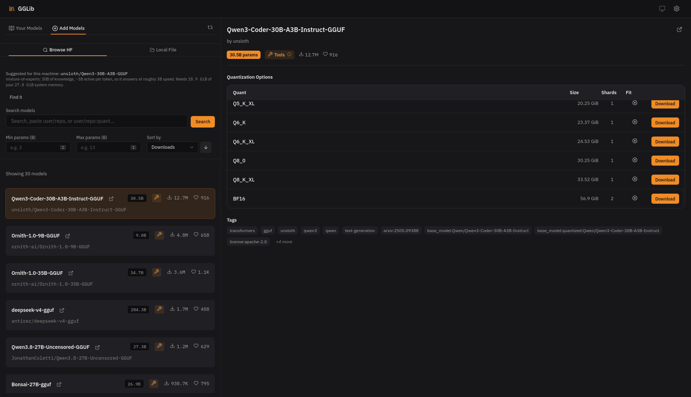
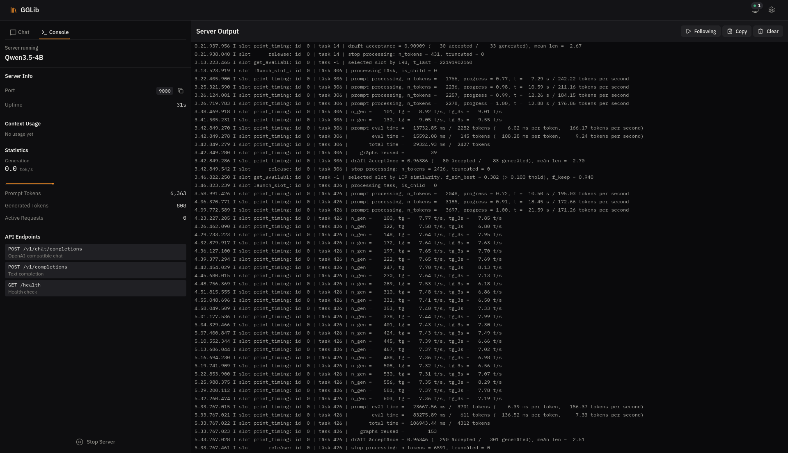
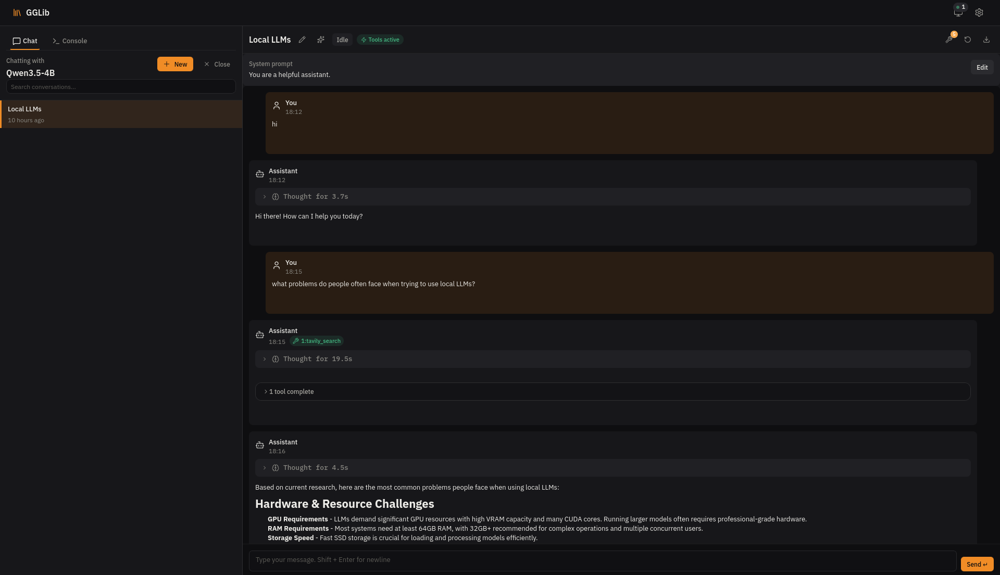
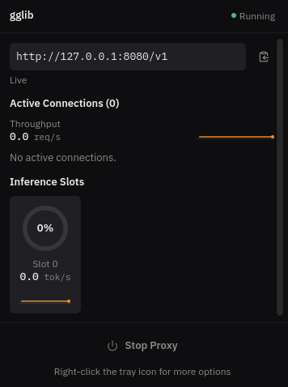

# GGLib

[](https://github.com/mmogr/gglib/actions/workflows/ci.yml)
[](https://github.com/mmogr/gglib/actions/workflows/coverage.yml)
[](https://github.com/mmogr/gglib/actions/workflows/release.yml)

[](LICENSE)

**The local model runtime that makes llama.cpp behave like an API provider.**

Running a local model with an agentic client means remembering where your GGUFs
live, figuring out llama-server flags for each model, and managing sampling
parameters. Even then, the model still produces broken tool calls, gets stuck
in loops, and ignores your sampling config.

GGLib handles the whole stack. It reads each GGUF's metadata and chat template
to figure out the right launch flags, tool-call format, and sampling defaults,
with no per-model config. It launches llama-server and runs an intelligent
proxy between your client and the model. To your client, your entire local GGUF
library looks like an OpenAI-compatible provider. Clients query `/v1/models`,
pick a model, and everything just works.

<p align="center">
  
  
</p>

## Get running

### Pre-built binary

Download a binary from the
[Releases page](https://github.com/mmogr/gglib/releases) (macOS, Linux,
Windows) and run it:

```bash
./gglib up
```

### Build from source

Requires Rust, Node.js 20.19+, and a C++ toolchain with CMake.
`gglib config check-deps` prints your platform's exact install commands.

```bash
git clone https://github.com/mmogr/gglib.git && cd gglib
make setup   # checks deps, builds everything, installs the gglib CLI
gglib up
```

`gglib up` reads your hardware, installs llama.cpp if missing, recommends a
model that fits your VRAM, starts the proxy, sends a test request to prove it
works, and prints the settings to paste into your client. You have a working
endpoint at `http://127.0.0.1:8080/v1`.

## What it fixes

Everything between the OpenAI request and llama-server is the product:

- **Tool-call repair**: `tool_choice: "auto"` can leave llama.cpp
  unconstrained, producing malformed arguments that crash the client's
  executor. GGLib validates every emitted tool call against the client's
  schema and silently re-issues failures with `tool_choice: "required"`,
  which activates llama.cpp's own grammar. The client only sees the
  corrected call. [Details →](docs/tool-call-repair.md)
- **Loop defense**: agentic clients replay the full conversation each turn,
  so the proxy scans the incoming history for tool-call batches repeated back
  to back, observation-tool spam, and repeated *response text* anywhere in the
  session. A stuck session is rejected with a clean 400 *before* it costs a
  model swap or another generation. The model never sees the request.
  [Details →](crates/gglib-proxy/README.md#loop--stagnation-defence)
- **Sampling authority**: a 5-level hierarchy (request → profile →
  per-model → global → floor) resolves every sampling parameter server-side.
  Client values are untrusted by default, so no request can silently override
  your configuration. [Details →](docs/sampling.md)
- **Context defense**: tool-heavy sessions balloon past the context window
  because most clients don't compact for custom endpoints. The proxy
  truncates oversized tool and assistant messages before forwarding, scaled
  to the model's actual context size, not a fixed floor.
  [Details →](crates/gglib-proxy/README.md#history-truncation)
- **Dialect normalization**: model-specific markup (Qwen XML tool calls,
  bare `<think>` tags) is parsed and re-encoded into strict OpenAI-format
  events. [Details →](docs/tags.md#format-dialect-tags)
- **KV cache tiering**: three layers, all auto-configured. `q8_0` KV
  quantization halves VRAM usage versus llama-server's default, a host-RAM
  prompt cache is auto-sized from your system memory on every launch, and
  opt-in disk slot persistence lets KV state survive model swaps and
  restarts. Sliding-window and hybrid-attention models are detected and
  excluded from disk caching automatically.
  [Details →](docs/cache.md)
- **Capability detection**: at import, GGLib reads GGUF metadata and renders
  the chat template against probe conversations to derive reasoning support,
  tool-call dialect, and speculative-decoding config. No per-model setup.
  [Details →](docs/tags.md)
- **Admission control**: alternating models (chat + embeddings) batch swaps
  instead of thrashing. [Details →](crates/gglib-runtime/src/process/admission/README.md)

## Client configuration

The endpoint is `http://127.0.0.1:8080/v1`. No API key is needed on loopback;
use any placeholder if your client requires one. Model names come from
`gglib model list` (shown as `qwen3.6` below).

| Client | Setup |
|--------|-------|
| **Cline / Roo Code** | Settings → API Provider: *OpenAI Compatible*, Base URL `http://127.0.0.1:8080/v1`, API Key `gglib`, Model ID `qwen3.6` |
| **Continue** | In `config.yaml`: provider `openai`, model `qwen3.6`, apiBase `http://127.0.0.1:8080/v1` |
| **Aider** | `OPENAI_API_BASE=http://127.0.0.1:8080/v1 OPENAI_API_KEY=gglib aider --model openai/qwen3.6` |
| **Zed** | In `settings.json` under `language_models.openai_compatible` ([example](docs/clients.md)) |

Append `:coding` to a model name (e.g. `qwen3.6:coding`) to select a sampling
profile. See [Sampling → Inference profiles](docs/sampling.md#inference-profiles-modelprofile).

## Day-to-day usage

```bash
# Download a model directly from a HuggingFace repo
gglib model download bartowski/Qwen3-4B-GGUF

# Search HuggingFace for models
gglib model search "gemma 3 instruct"

# List your installed models
gglib model list

# Start the proxy (all models available via /v1/models)
gglib proxy

# Ask a one-shot question
gglib q "Explain the builder pattern in Rust"

# Pipe context in
cat error.log | gglib q "What went wrong here?"

# Interactive chat
gglib chat
```

## Configure

Optional, after first run:

```bash
gglib config settings set --default-context-size 131072
gglib config settings set --proxy-autostart true --close-to-tray true
```

## Benchmark and tune

```bash
# Compare the same prompt across multiple models side-by-side
gglib benchmark compare -p "Explain ownership in Rust" -m Qwen3-4B -m Gemma3-4B

# Measure raw throughput (prompt processing + generation) via llama-bench
gglib benchmark perf -m Qwen3-4B

# Sweep sampling parameters to find the best settings for a model,
# scored on tool-call accuracy, loop avoidance, and task completion
gglib benchmark tune -m Qwen3-4B --sweep temperature=0.2,0.5,0.8 --apply

# A/B test: run the agentic suite through raw llama-server vs. through
# the GGLib proxy on the same model and seeds
gglib benchmark agentic -m Qwen3-4B --seeds 12345,67890
```

The agentic benchmark includes its own A/A arm and positive control so it
can't overclaim. Full methodology:
[ADR 0004](docs/adr/0004-observe-the-sampling-boundary.md).

## Interfaces

All interfaces share the same database and model directory.

| Interface | Command | Details |
|-----------|---------|---------|
| OpenAI proxy | `gglib proxy` | [gglib-proxy](crates/gglib-proxy/README.md) |
| Pinned endpoint | `gglib serve <id>` | Same proxy, locked to one model |
| CLI | `gglib <command>` | [gglib-cli](crates/gglib-cli/README.md) |
| Desktop GUI | `gglib gui` | [gglib-tauri](crates/gglib-tauri/README.md) |
| Web UI | `gglib web` | [gglib-axum](crates/gglib-axum/README.md) |
| Dashboard | `gglib proxy dashboard` | Live terminal view of connections, cache, and requests |

`gglib proxy dashboard` streams live proxy state to your terminal:

```text
Active connections (1)
  slot 0  Qwen3.5-4B  task 426  generating  7.36 t/s

Slots (llama.cpp /slots)
  slot 0  [████████████░░░░░░░░]  58%

VRAM residency
  Qwen3.5-4B (Q8_0)  6.4 GiB loaded
  Model swaps        0

Prompt cache
  Reused       2,278 of 8,641 prompt tokens (3 requests)
  Last request 2,278 of 5,979 tokens from cache

Client sampling dropped (trust_client_sampling off)
  temperature: 3 requests
```

The desktop GUI doubles as a quick way to test models and as an always-on
proxy host. `--proxy-autostart`, `--close-to-tray`, and `--start-at-login`
keep the endpoint available without a terminal window.

<p align="center">
  
  &nbsp;&nbsp;
  
</p>

## Security

Everything binds `127.0.0.1` by default. **Do not expose the endpoint to the
public internet.** Optional bearer API key on loopback; auto-minted if you bind
externally. Host-header allowlist and local-only CORS are always on. No
multi-tenancy or rate limiting. Details in
[gglib-proxy](crates/gglib-proxy/README.md).

## Architecture

~17-crate Rust workspace + React front end. CI-enforced dependency direction:
adapters → facades → infrastructure → core. See [`crates/`](crates/) for
per-crate READMEs and architecture diagrams, [CONTRIBUTING.md](CONTRIBUTING.md)
for conventions, and [generated API docs](https://mmogr.github.io/gglib).

## Documentation

- [Sampling resolution](docs/sampling.md)
- [Tags & capability detection](docs/tags.md)
- [KV cache tiering](docs/cache.md)
- [Tool-call repair](docs/tool-call-repair.md)
- [Architecture Decision Records](docs/adr/)
- [Full API docs](https://mmogr.github.io/gglib)

## License

[AGPL-3.0](LICENSE). Personal and open-source use is free. Commercial use
requires a commercial license. Contact [@mmogr](https://github.com/mmogr).
