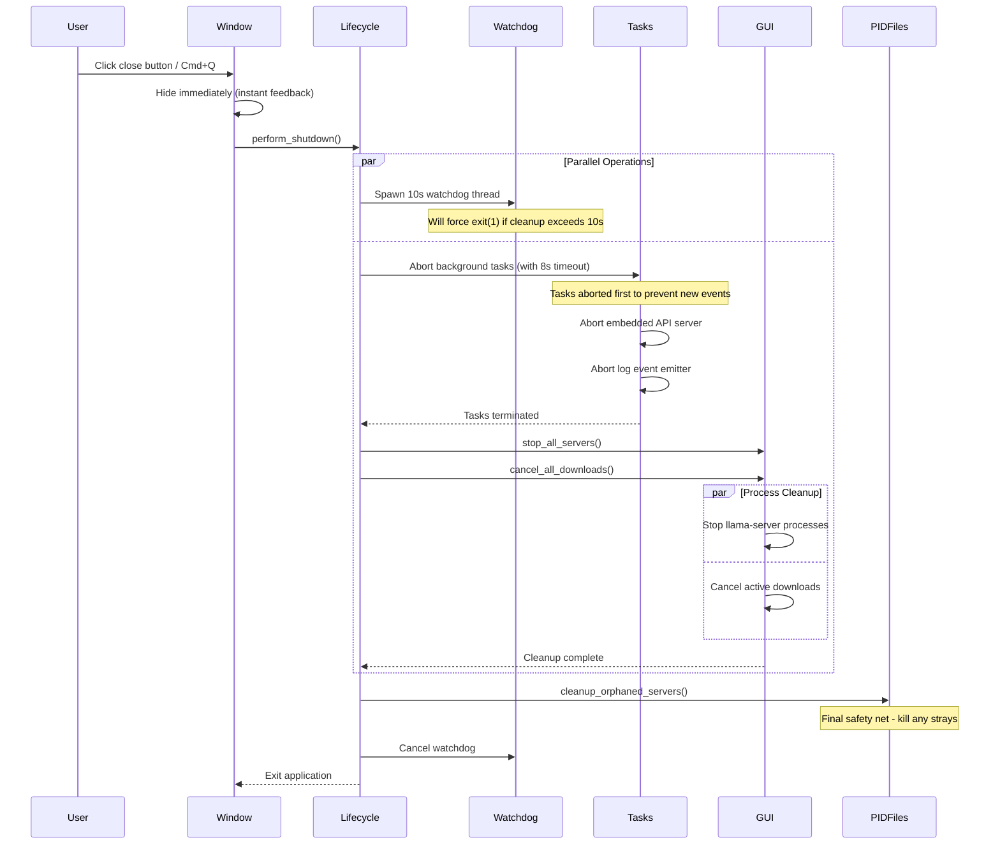

# Application Lifecycle & Shutdown Architecture

This document describes the startup and shutdown lifecycle of the GGLib Tauri desktop application, with emphasis on the hardened shutdown architecture that prevents resource leaks.

## Startup Sequence

The application initializes through the following stages:

1. **Bootstrap Context** (`main.rs::setup`)
   - Initialize database pool and repositories
   - Create process runner (llama-server management)
   - Instantiate core services (AppCore, ModelService, etc.)
   - Create MCP service, download manager, HuggingFace client
   - Build GUI backend facade

2. **Start Embedded API Server**
   - Spawn Axum server on `127.0.0.1:0` (ephemeral port)
   - Generate random UUID Bearer token for authentication
   - **Store server JoinHandle in AppState** for cleanup

3. **Initialize Background Tasks**
   - Spawn server log event emitter task
   - **Store log task JoinHandle in AppState** for cleanup
   - Preflight Python download helper (non-blocking)

4. **Cleanup & Setup**
   - Run orphaned process cleanup (from previous crashes)
   - Build native menu (macOS)
   - Emit initial server snapshot to frontend

## Shutdown Architecture

The application implements a **defense-in-depth** shutdown strategy with three layers of protection:

### Layer 1: Watchdog Thread (10 seconds)

Spawned immediately when shutdown begins. If cleanup exceeds 10 seconds, the watchdog force-kills the application with `exit(1)`.

```rust
std::thread::spawn(move || {
    std::thread::sleep(Duration::from_secs(10));
    if watchdog_cancel_rx.try_recv().is_err() {
        eprintln!("SHUTDOWN WATCHDOG: Cleanup exceeded 10 seconds - forcing exit");
        std::process::exit(1);
    }
});
```

**Why?** Prevents the GUI from appearing hung if cleanup blocks indefinitely.

### Layer 2: Timeout-Protected Cleanup (8 seconds)

All cleanup operations are wrapped in an 8-second timeout, leaving a 2-second buffer before the watchdog triggers.

```rust
tokio::time::timeout(
    Duration::from_secs(8),
    parallel_cleanup(state)
).await
```

**Why?** Ensures unresponsive resources (stuck network calls, unresponsive processes) don't block shutdown.

### Layer 3: Parallel Cleanup Operations

Cleanup operations are executed in the optimal order with parallelization where safe:

#### Step 1: Abort Background Tasks (Sequential)

**CRITICAL:** This must happen first to prevent new events from being emitted while we're shutting down.

```rust
let mut tasks = state.background_tasks.write().await;

if let Some(server_task) = tasks.embedded_server.take() {
    server_task.abort();  // Kill embedded Axum server
}

if let Some(log_task) = tasks.log_emitter.take() {
    log_task.abort();  // Kill log event emitter loop
}
```

**Why abort() is necessary:** In Tokio, tasks spawned with `tokio::spawn` are detached and continue running even if the spawning function returns. Without explicit `.abort()`, these tasks would:
- Continue consuming threads
- Leak memory and resources
- Accumulate across GUI launches
- Eventually exhaust system thread limits

#### Step 2: Stop Servers & Downloads (Parallel)

```rust
tokio::join!(
    state.gui.stop_all_servers(),     // Graceful SIGTERM → SIGKILL
    state.gui.cancel_all_downloads()  // Abort active downloads
);
```

**Why parallel?** These operations are independent and benefit from concurrent execution.

#### Step 3: PID File Audit (Final Safety Net)

```rust
cleanup_orphaned_servers().await
```

Scans PID files and ensures any llama-server processes that escaped cleanup are killed. Handles cases like:
- Processes that were already running before GUI started
- Processes that failed to respond to SIGTERM/SIGKILL in time
- PID file corruption or stale entries

## Shutdown Trigger Points

The hardened shutdown sequence is invoked from two entry points:

### 1. Window Close Button

```rust
.on_window_event(|window, event| {
    if let tauri::WindowEvent::CloseRequested { api, .. } = event {
        api.prevent_close();  // Don't close yet
        let _ = window.hide();  // Hide immediately for UX feedback
        
        tauri::async_runtime::spawn(async move {
            let state: tauri::State<AppState> = app_handle.state();
            lifecycle::perform_shutdown(&state).await;
            app_handle.exit(0);
        });
    }
})
```

### 2. Application Menu Quit (macOS Cmd+Q)

```rust
.run(|app_handle, event| {
    match event {
        tauri::RunEvent::ExitRequested { api, .. } => {
            api.prevent_exit();  // Don't exit yet
            
            tauri::async_runtime::spawn(async move {
                let state: tauri::State<AppState> = handle_for_exit.state();
                lifecycle::perform_shutdown(&state).await;
                handle_for_exit.exit(0);
            });
        }
        _ => {}
    }
})
```

## Sequence Diagram



## Resource Leak Prevention

### The Problem (Before Hardened Shutdown)

When background tasks are spawned but not tracked:

```rust
// ❌ BAD: Handle is dropped, task runs forever
let (_server_handle) = start_embedded_server(...).await?;

tauri::async_runtime::spawn(async move {
    loop {
        // ❌ BAD: Loop never exits, accumulates threads
        receiver.recv().await;
    }
});
```

**Result:** Each GUI launch would:
1. Spawn an embedded Axum server (never stopped)
2. Spawn a log event emitter loop (never cancelled)
3. Leak threads and memory
4. Eventually hit OS thread limits: `"Resource temporarily unavailable"`

### The Solution (Current Architecture)

Store handles and explicitly abort:

```rust
// ✅ GOOD: Store handle in AppState
let (embedded_api, server_handle) = start_embedded_server(...).await?;
tasks.write().await.embedded_server = Some(server_handle);

// ✅ GOOD: Store log task handle
let log_task = tauri::async_runtime::spawn(async move {
    loop {
        match receiver.recv().await {
            Err(RecvError::Closed) => break,  // Exit gracefully
            // ... handle events
        }
    }
});
tasks.write().await.log_emitter = Some(log_task);

// ✅ GOOD: Explicit cleanup during shutdown
if let Some(server_task) = tasks.embedded_server.take() {
    server_task.abort();
}
if let Some(log_task) = tasks.log_emitter.take() {
    log_task.abort();
}
```

**Result:** All resources are properly cleaned up on exit.

## Testing Shutdown Behavior

### Manual Validation

```bash
# 1. Clean slate
pkill -9 gglib; pkill -9 llama-server
ps aux | grep gglib  # Should show nothing

# 2. Test iteration 1
gglib gui
# (close the window using the X button)
sleep 10
ps aux | grep gglib  # Should show nothing

# 3. Repeat 2-3 more times
# No "Resource temporarily unavailable" errors should occur
```

### Expected Behavior

- Window closes within 1-2 seconds
- No error messages in console
- No `gglib` processes remain after 10 seconds
- Can launch GUI repeatedly without errors

### Troubleshooting

If shutdown hangs:
1. Check logs for timeout messages
2. Verify watchdog triggers after 10s (force exit)
3. Check for blocked async operations in cleanup

If processes leak:
1. Verify `BackgroundTasks` handles are populated during startup
2. Confirm `.abort()` is called on both handles
3. Check for `tokio::spawn` calls not storing handles

## Code References

- **AppState & BackgroundTasks**: [`src-tauri/src/app/state.rs`](src/app/state.rs)
- **Shutdown Orchestration**: [`src-tauri/src/lifecycle.rs`](src/lifecycle.rs)
- **Startup & Handle Storage**: [`src-tauri/src/main.rs`](src/main.rs)

## Related Documentation

- [App Module README](src/app/README.md) - Application state and event infrastructure
- [Tauri README](README.md) - Overall architecture and development guide
