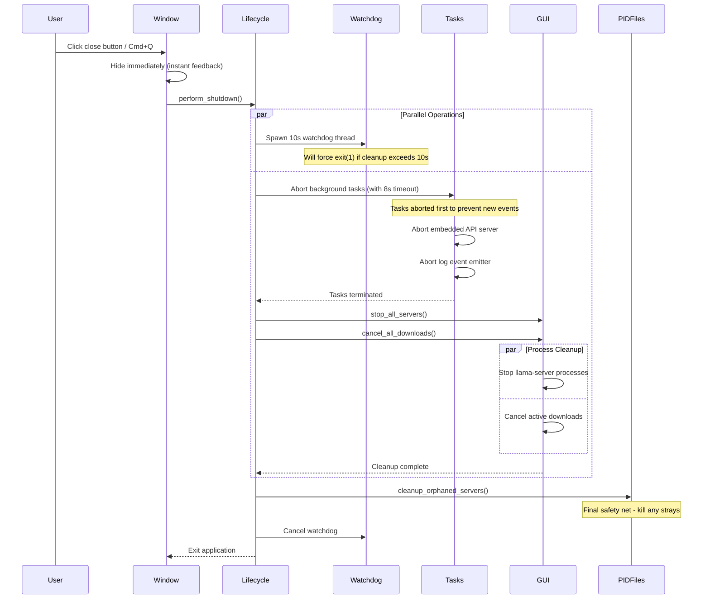

<!-- module-docs:start -->

# App Module

The app module provides the central application state and event infrastructure for the Tauri desktop GUI.

## Architecture

```text
┌─────────────────────────────────────────────────────────────────────┐
│                         AppState (Managed)                          │
├─────────────────────────────────────────────────────────────────────┤
│                                                                     │
│  ┌─────────────────┐  ┌─────────────────┐  ┌─────────────────────┐ │
│  │    backend      │  │    api_port     │  │  selected_model_id  │ │
│  │  Arc<GuiBackend>│  │      u16        │  │ Arc<RwLock<Option>> │ │
│  └────────┬────────┘  └────────┬────────┘  └──────────┬──────────┘ │
│           │                    │                      │            │
│           │                    │                      │            │
│  ┌────────▼────────┐  ┌────────▼────────┐  ┌─────────▼──────────┐ │
│  │     menu        │  │ Embedded HTTP   │  │   Menu State Sync  │ │
│  │ Arc<RwLock<     │  │ Server (axum)   │  │   (enable/disable  │ │
│  │   AppMenu>>     │  │ localhost:port  │  │    items based on  │ │
│  └─────────────────┘  └─────────────────┘  │    selection)      │ │
│                                            └────────────────────┘ │
└─────────────────────────────────────────────────────────────────────┘
                              │
        ┌─────────────────────┼─────────────────────┐
        ▼                     ▼                     ▼
┌──────────────┐    ┌──────────────────┐    ┌──────────────┐
│  commands/*  │    │     menu/*       │    │  React UI    │
│  (read state)│    │ (sync state)     │    │  (via HTTP)  │
└──────────────┘    └──────────────────┘    └──────────────┘
```

## Components

- **mod.rs**: Re-exports `state` and `events` submodules.
- **state.rs**: Defines `AppState` — the central state container managed by Tauri. Holds the shared `GuiBackend`, embedded API port, native menu references, currently selected model ID, and background task handles for proper cleanup.
- **events.rs**: Provides `emit_or_log()` helper for fire-and-forget event emission, plus constants for all Tauri event names (download progress, server lifecycle, menu actions).

## Lifecycle Management

### Startup Sequence

1. Bootstrap application context (database, services, process runner)
2. Build GUI backend from context
3. Start embedded Axum API server on ephemeral port
4. **Store background task handles** (server task, log emitter task)
5. Preflight Python download helper
6. Clean up any orphaned processes from previous crashes
7. Setup native menu (macOS)
8. Emit initial server snapshot to frontend

### Hardened Shutdown Sequence

The application uses a **hardened multi-layer shutdown** to prevent resource leaks and ensure all background tasks are properly terminated:



**Key Features:**

1. **Watchdog Protection** (10s): Force-kills application if shutdown hangs
2. **Timeout-Protected Cleanup** (8s): Prevents indefinite blocking on unresponsive resources
3. **Background Task Abortion**: Explicitly terminates embedded server and log emitter tasks
4. **Parallel Operations**: Stops servers and downloads concurrently
5. **PID File Audit**: Final sweep to catch any orphaned llama-server processes

**Why This Matters:**

Before this architecture, background tasks spawned with `tokio::spawn` would continue running even after the GUI closed. This caused:
- Thread exhaustion ("Resource temporarily unavailable" errors)
- Zombie processes accumulating with each launch
- Port conflicts from leaked embedded servers

By storing `JoinHandle`s and explicitly calling `.abort()` during shutdown, all resources are properly released.

## Event System

The Tauri application uses events for real-time communication between the Rust backend and React frontend.

```text
Backend Operation (server start, download progress, etc.)
          │
          ▼
    ┌─────────────────────┐
    │  emit_or_log()      │◄── Logs errors instead of panicking
    │  (events.rs)        │
    └──────────┬──────────┘
               │
               ▼
    ┌─────────────────────┐
    │  Tauri Event Bus    │
    │                     │
    │  Events:            │
    │  • download-progress│
    │  • server:started   │
    │  • server:stopped   │
    │  • server:error     │
    │  • server:snapshot  │
    │  • menu:*           │
    └──────────┬──────────┘
               │
               ▼
    ┌─────────────────────┐
    │  React Listeners    │
    │  (useEffect hooks)  │
    └─────────────────────┘
```

### Event Constants

| Category | Events |
|----------|--------|
| Downloads | `DOWNLOAD_PROGRESS` |
| Server Lifecycle | `server:started`, `server:stopped`, `server:error`, `server:snapshot`, `server:health_changed` |
| Menu Actions | `MENU_ADD_MODEL`, `MENU_REMOVE_MODEL`, `MENU_BROWSE_HUGGINGFACE`, `MENU_START_SERVER`, `MENU_STOP_SERVER`, `MENU_OPEN_CHAT`, `MENU_INSTALL_LLAMA` |

<!-- module-docs:end -->
